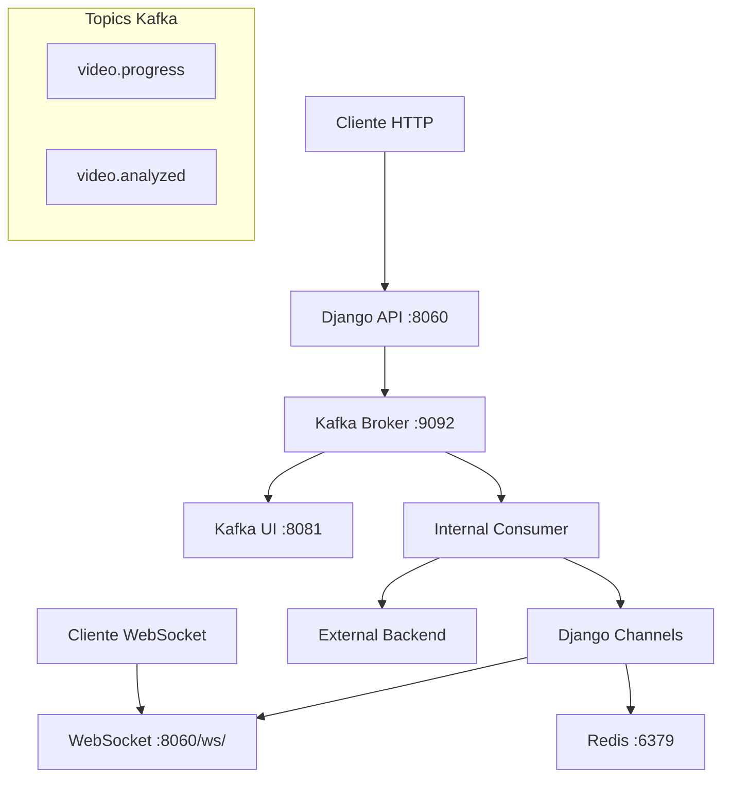

# Kafka WebSocket Service - Django Channels + Kafka Integration

## 📋 Descripción General

Este proyecto implementa una plataforma ligera que expone API REST para iniciar tareas de video, publica el progreso en Kafka y lo retransmite en tiempo real por WebSocket a cualquier cliente conectado.

### Stack Tecnológico

- **Django 6.0.1** + **Django Channels 4.3.2** para WebSockets
- **Apache Kafka** (single broker con KRaft) para mensajería asíncrona
- **Redis 7** como backend de canales para Django Channels
- **Python 3.13** con kafka-python y compresión LZ4
- **Docker Compose** para orquestación de servicios

### Componentes Principales

- **Django Web App**: API REST que publica eventos en Kafka (puerto 8060)
- **Kafka Consumer**: Consumidor interno que lee eventos y los reenvía a grupos de canales
- **WebSocket Server**: Empuja actualizaciones JSON en tiempo real al navegador
- **Kafka Broker**: Broker único con compresión LZ4 habilitada
- **Redis**: Backend de canales para comunicación entre procesos
- **Kafka UI**: Interfaz web para monitoreo del cluster

## 🏢️ Arquitectura del Sistema



### Flujo de Procesamiento

1. **Cliente HTTP** envía POST a Django API para iniciar tarea de video
2. **Django** publica evento en topic Kafka (`video.progress` o `video.analyzed`)
3. **Consumer interno** lee mensaje del topic y valida el esquema
4. **Consumer** reenvía al grupo de canales correspondiente vía Django Channels
5. **WebSocket** empuja actualización JSON en tiempo real al cliente conectado
6. **Para `video.analyzed`**: También envía datos al backend externo configurado

## 📋 Prerrequisitos

- **Windows 10/11** con PowerShell 7.x
- **Python 3.13+** (opcional para desarrollo local)
- **uv** - Gestor de paquetes y entornos virtuales moderno
- **Docker Desktop** con Docker Compose v2
- **WSL 2** (recomendado para mejor rendimiento)
- **Recursos mínimos**: 4GB RAM, 2 CPUs, 5GB espacio libre
- **Puertos libres**: 8060, 8081, 9092, 6379

### Instalación de uv

```powershell
# Instalar uv usando el instalador oficial
powershell -c "irm https://astral.sh/uv/install.ps1 | iex"

# Verificar instalación
uv --version
```

### Verificar Instalación

```powershell
# Verificar Docker
docker --version
docker compose version

# Verificar PowerShell y uv
$PSVersionTable.PSVersion
uv --version
```

## 🚀 Instalación y Despliegue

### 1. Clonar y Navegar al Proyecto

```powershell
Set-Location C:\Users\Usuario\Desktop\projects\kafkaservice
```

### 2. Configurar Entorno de Desarrollo (Opcional)

Para desarrollo local, puedes sincronizar el entorno virtual con uv:

```powershell
# Crear y sincronizar entorno virtual con todas las dependencias
uv sync

# Activar el entorno virtual
.venv\Scripts\Activate.ps1

# Verificar que Django esté instalado
python -m django --version
```

### 3. Configurar Variables de Entorno

Crea un archivo `.env` con las variables necesarias:

```powershell
# Crear archivo .env con configuración por defecto
@'
KAFKA_BROKER=kafka:9092
KAFKA_GROUP_ID=video-consumer-group
REDIS_URL=redis://redis:6379
BACKEND_ENDPOINT=http://your-backend:8080
'@ | Out-File -FilePath .env -Encoding utf8

# Ver configuración actual
Get-Content .env
```

### 4. Levantar el Stack Completo

```powershell
# Construir imágenes locales
docker compose build

# Levantar todos los servicios
docker compose up -d

# Verificar estado de los servicios
docker compose ps
```

### 5. Verificar que Todo Funciona

```powershell
# Verificar servicios activos
docker compose ps

# Verificar Django API
curl http://localhost:8060/api/
curl http://localhost:8081  # Kafka UI

# Ver topics creados (deberían estar video.progress y video.analyzed)
docker compose exec kafka kafka-topics --list --bootstrap-server kafka:9092

# Verificar logs del consumer Kafka
docker compose logs django-web
```

## 🛠️ Servicios del Docker Compose

### Django Web Application

- **Puerto**: 8060 (mapeado desde 8000 interno)
- **Endpoints**: `/api/post_event/`, `/api/start-video-upload/`, `/api/start-video-analysis/`
- **WebSockets**: `/ws/video-progress/{video_id}/`
- **Función**: API REST + WebSocket server + Consumer Kafka interno
- **Base de datos**: SQLite local para desarrollo

### Kafka Broker (Single Node)

- **Puerto**: 9092 (interno) y 19092 (externo)
- **Modo**: KRaft (sin Zookeeper)
- **Compresión**: LZ4 habilitada
- **Topics**: `video.progress`, `video.analyzed`
- **Volúmenes**: Datos persistentes en `broker_data`

### Redis

- **Puerto**: 6379
- **Función**: Backend de canales para Django Channels
- **Configuración**: Redis 7 Alpine, sin persistencia

### Kafka UI

- **Puerto**: 8081
- **Función**: Interfaz web para monitoreo del broker
- **Acceso**: http://localhost:8081
- **Configuración**: Dinámica habilitada

## 📡 API REST de Django

### Base URL
```
http://localhost:8060/api/
```

### Endpoints HTTP

#### 1. Evento Genérico de Kafka
```http
POST /api/post_event/
Content-Type: application/json
```

**Cuerpo de la Petición:**
```json
{
  "topic": "video.progress",
  "payload": {
    "video_id": "12345",
    "progress": 50,
    "status": "uploading"
  }
}
```

**Respuesta Exitosa (200):**
```json
{
  "status": "sent"
}
```

#### 2. Iniciar Subida de Video
```http
POST /api/start-video-upload/
Content-Type: application/json
```

**Cuerpo de la Petición:**
```json
{
  "video_id": "video-123",
  "progress": 0,
  "status": "started"
}
```

**Respuesta Exitosa (200):**
```json
{
  "video_id": "video-123",
  "status": "started",
  "progress": 0
}
```

#### 3. Iniciar Análisis de Video
```http
POST /api/start-video-analysis/
Content-Type: application/json
```

**Cuerpo de la Petición:**
```json
{
  "video_name": "partido_final.mp4",
  "match_id": 12345
}
```

**Respuesta Exitosa (200):**
```json
{
  "status": "El video está siendo analizado",
  "video_name": "partido_final.mp4",
  "match_id": 12345
}
```

**Respuesta de Error (400):**
```json
{
  "error": "video_name es requerido"
}
```

### WebSocket Endpoint

#### Conectar al Progreso de Video
```
ws://localhost:8060/ws/video-progress/{video_id}/
```

**Mensajes de Progreso:**
```json
{
  "progress": 75,
  "status": "uploading"
}
```

### Ejemplos de Uso

#### PowerShell
```powershell
$body = @{
    video_url = "https://firebasestorage.googleapis.com/v0/b/mybucket/o/videos%2Ftest.mp4?alt=media&token=xyz"
    metadata = @{
        source = "api-test"
        priority = "normal"
    }
} | ConvertTo-Json

Invoke-RestMethod -Uri "http://localhost:8080/publish" -Method Post -Body $body -ContentType "application/json"
```

#### cURL
```bash
curl -X POST http://localhost:8080/publish \
  -H "Content-Type: application/json" \
  -d '{
    "video_url": "https://example.com/video.mp4",
    "metadata": {"source": "curl-test"}
  }'
```

## 📝 Formato de Mensajes Kafka

### Topic: `video.progress`

**Estructura del Mensaje:**
```json
{
  "video_id": "video-123",
  "progress": 75,
  "status": "uploading"
}
```

**Estados válidos:** `uploading`, `started`, `finished`

**Progreso:** Entero entre 0 y 100

### Topic: `video.analyzed`

**Estructura del Mensaje:**
```json
{
  "video_name": "partido_final.mp4",
  "match_id": 12345
}
```

### Configuración de Topics

- **Replicación:** Factor 1 (single broker)
- **Compresión:** LZ4 habilitada en broker
- **Auto-commit:** Habilitado desde earliest
- **Whitelist:** Solo topics permitidos en `KAFKA_CONFIG["ALLOWED_TOPICS"]`

### Payload al Backend Externo

Para `video.analyzed`, el consumer envía al `BACKEND_ENDPOINT`:

```json
{
  "video_name": "partido_final.mp4",
  "match_id": 12345
}
```

**Endpoint de destino:** `{BACKEND_ENDPOINT}/analyze/run`
**Método:** POST con retry exponencial hasta 3 intentos

## 🔄 Flujo de Procesamiento Detallado

### 1. Recepción de Petición
- Cliente HTTP POST → Producer API `:8080/publish`
- Validación del payload usando Pydantic
- Generación de `message_id` único y timestamp

### 2. Publicación en Kafka
- Envío al topic `video-topic`
- Key basada en URL para ordenamiento
- Configuración de retry y idempotencia
- Confirmación de escritura (acks=all)

### 3. Consumo y Procesamiento
- Consumer lee mensaje con group ID `video-group`
- Validación del esquema del mensaje
- Retry automático en fallos transitorios
- Circuit breaker para fallos consecutivos

### 4. Envío al Backend
- HTTP POST al `BACKEND_ENDPOINT` configurado
- Retry con backoff exponencial
- Commit del offset solo tras éxito del backend
- Manejo de errores 4xx vs 5xx

### 5. Finalización
- Offset committeado en Kafka
- Mensaje marcado como procesado
- Log de métricas y trazabilidad

## ⚙️ Variables de Entorno

### Configuración de Kafka
| Variable | Descripción | Valor por Defecto | Requerido |
|----------|-------------|------------------|----------|
| `KAFKA_BROKER` | Dirección del broker | `kafka:9092` | Sí |
| `KAFKA_GROUP_ID` | Group ID del consumer | `video-consumer-group` | Sí |

### Configuración de Redis
| Variable | Descripción | Valor por Defecto | Requerido |
|----------|-------------|------------------|----------|
| `REDIS_URL` | URL de Redis para Channels | `redis://redis:6379` | Sí |

### Configuración del Backend Externo
| Variable | Descripción | Valor por Defecto | Requerido |
|----------|-------------|------------------|----------|
| `BACKEND_ENDPOINT` | URL del backend para análisis | - | Sí |

### Topics Permitidos

Configurados en `settings.py`:
- `video.progress`
- `video.analyzed`

### Personalización

```powershell
# Cambiar el endpoint del backend
$env:BACKEND_ENDPOINT = "http://mi-backend:8080/procesar"

# Cambiar el nombre del topic
$env:KAFKA_TOPIC = "mi-topic-videos"

# Reiniciar servicios con nueva configuración
docker compose restart producer consumer
```

## 📊 Monitoreo y Observabilidad

### Verificar Estado de Servicios

```powershell
# Estado general
docker compose ps

# Logs en tiempo real
docker compose logs -f producer
docker compose logs -f consumer
docker compose logs -f broker1

# Healthchecks
curl http://localhost:8080/health
```

### Kafka UI - Monitoring Dashboard

Accede a http://localhost:8081 para:
- Ver topics, particiones y mensajes
- Monitorear consumer groups y lag
- Inspeccionar mensajes individuales
- Ver métricas del cluster

### Comandos Útiles de Kafka

```powershell
# Listar topics
docker compose exec broker1 kafka-topics --list --bootstrap-server broker1:9092

# Describir topic
docker compose exec broker1 kafka-topics --describe --topic video-topic --bootstrap-server broker1:9092

# Ver mensajes en tiempo real
docker compose exec broker1 kafka-console-consumer --topic video-topic --from-beginning --bootstrap-server broker1:9092

# Ver consumer groups
docker compose exec broker1 kafka-consumer-groups --list --bootstrap-server broker1:9092

# Ver lag del consumer group
docker compose exec broker1 kafka-consumer-groups --describe --group video-group --bootstrap-server broker1:9092
```

## 🛠️ Troubleshooting

### Problemas Comunes

#### Servicios no inician
```powershell
# Verificar puertos ocupados
netstat -an | findstr ":8080"
netstat -an | findstr ":9092"

# Ver logs detallados
docker compose logs broker1
docker compose logs producer
```

#### Consumer no procesa mensajes
```powershell
# Verificar conexión al backend
curl -X POST http://backend:8040/process_video -H "Content-Type: application/json" -d "{}"

# Reset consumer offset (CUIDADO: solo desarrollo)
docker compose exec broker1 kafka-consumer-groups --reset-offsets --to-earliest --group video-group --topic video-topic --bootstrap-server broker1:9092
```

#### Errores de conexión Kafka
```powershell
# Verificar DNS interno
docker compose exec producer nslookup broker1
docker compose exec consumer nslookup broker1

# Reiniciar cluster Kafka
docker compose restart broker1 broker2 broker3
```

### Logs de Error Típicos

- **"Connection timeout"**: Verificar red Docker y DNS
- **"Topic does not exist"**: Ejecutar init-topics manualmente
- **"No route to host"**: Verificar firewall y puertos
- **"Serialization error"**: Verificar formato JSON del payload

## 🏃‍♂️ Ejemplos de Uso Completos

### Ejemplo 1: Procesamiento Básico

```powershell
# 1. Enviar video para procesamiento
$response = Invoke-RestMethod -Uri "http://localhost:8080/publish" -Method Post -Body '{
  "video_url": "https://sample-videos.com/zip/10/mp4/mp4/SampleVideo_1280x720_1mb.mp4",
  "metadata": {"test": true}
}' -ContentType "application/json"

Write-Host "Video enviado: Partition $($response.partition), Offset $($response.offset)"

# 2. Ver el mensaje en Kafka
docker compose exec broker1 kafka-console-consumer --topic video-topic --from-beginning --bootstrap-server broker1:9092 --max-messages 1

# 3. Ver logs del consumer procesando
docker compose logs -f consumer
```

### Ejemplo 2: Monitoreo en Kafka UI

1. Abrir http://localhost:8081
2. Navegar a Topics → video-topic
3. Ver mensajes en "Messages" tab
4. Revisar Consumer Groups para ver el progreso

### Ejemplo 3: Simulación de Carga

```powershell
# Script para enviar múltiples videos
$urls = @(
    "https://sample-videos.com/zip/10/mp4/mp4/SampleVideo_640x360_1mb.mp4",
    "https://sample-videos.com/zip/10/mp4/mp4/SampleVideo_1280x720_2mb.mp4"
)

foreach ($url in $urls) {
    $body = @{
        video_url = $url
        metadata = @{
            batch_id = [Guid]::NewGuid().ToString()
            timestamp = Get-Date -Format "yyyy-MM-ddTHH:mm:ssZ"
        }
    } | ConvertTo-Json
    
    $result = Invoke-RestMethod -Uri "http://localhost:8080/publish" -Method Post -Body $body -ContentType "application/json"
    Write-Host "Enviado: $url -> Offset $($result.offset)"
    Start-Sleep 1
}
```

## 🔧 Modificaciones y Extensibilidad

### Agregar Nuevo Procesamiento

1. **Extender el Consumer**:
   ```python
   # En consumer.py, agregar nueva lógica en process_message()
   if video_msg.metadata.get("type") == "thumbnail":
       await process_thumbnail(video_msg)
   ```

2. **Actualizar el esquema de metadatos**:
   ```json
   {
     "video_url": "...",
     "metadata": {
       "type": "thumbnail|transcoding|analysis",
       "options": {"resolution": "720p"}
     }
   }
   ```

### Escalar Horizontalmente

```powershell
# Aumentar número de consumers
docker compose up -d --scale consumer=3

# Verificar distribución de particiones
docker compose exec broker1 kafka-consumer-groups --describe --group video-group --bootstrap-server broker1:9092
```

### Agregar Nuevo Servicio

```yaml
# En docker-compose.yml
  nuevo-servicio:
    build: ./nuevo-servicio
    depends_on:
      - broker1
      - broker2
      - broker3
    environment:
      - KAFKA_BOOTSTRAP=broker1:9092,broker2:9092,broker3:9092
    networks:
      - kafka-net
```

### Migrar a Producción

1. **Configurar autenticación SASL**
2. **Habilitar SSL/TLS**
3. **Configurar volúmenes persistentes**
4. **Ajustar recursos y límites**
5. **Implementar monitoreo con Prometheus**

```yaml
# Ejemplo configuración productiva
  broker1:
    environment:
      KAFKA_LISTENERS: SASL_SSL://:9092,CONTROLLER://:9093
      KAFKA_SECURITY_INTER_BROKER_PROTOCOL: SASL_SSL
      KAFKA_SASL_MECHANISM_INTER_BROKER_PROTOCOL: PLAIN
    volumes:
      - /var/kafka-data:/var/lib/kafka/data
      - /etc/kafka/ssl:/etc/kafka/ssl:ro
```

## 🚧 Para Desarrollo Futuro

### Checklist de Modificaciones

- [ ] **Esquemas**: ¿Afecta el formato de mensajes?
- [ ] **API**: ¿Cambian los endpoints o contratos?
- [ ] **Topics**: ¿Se necesitan nuevos topics?
- [ ] **Particiones**: ¿Hay que ajustar el particionado?
- [ ] **Consumer Groups**: ¿Afecta el balanceo de carga?
- [ ] **Backend**: ¿Cambia la integración downstream?
- [ ] **Versionado**: ¿Se mantiene compatibilidad hacia atrás?

### Próximas Mejoras Sugeridas

1. **Schema Registry** para versionado de mensajes
2. **Dead Letter Queue** para mensajes fallidos
3. **Métricas con Prometheus + Grafana**
4. **Autenticación JWT en la API**
5. **Compresión y particionado inteligente**
6. **Tests de integración automatizados**

## ❓ Preguntas Frecuentes

**P: ¿Puedo usar URLs que no sean de Firebase Storage?**
R: Sí, el sistema acepta cualquier URL HTTP/HTTPS válida.

**P: ¿Qué pasa si el backend está caído?**
R: El consumer reintentar con backoff exponencial y activará un circuit breaker tras fallos consecutivos.

**P: ¿Puedo procesar el mismo video múltiples veces?**
R: Sí, cada envío genera un `message_id` único, permitiendo reprocesamiento.

**P: ¿Cómo escalo para más throughput?**
R: Aumenta las particiones del topic y el número de instancias del consumer.

**P: ¿Los datos se persisten si reinicio Docker?**
R: Sí, los volúmenes de Kafka mantienen topics y offsets entre reinicios.

---

**📞 Soporte**: Para problemas o dudas, revisar logs con `docker compose logs [servicio]` y verificar la conectividad de red entre contenedores.